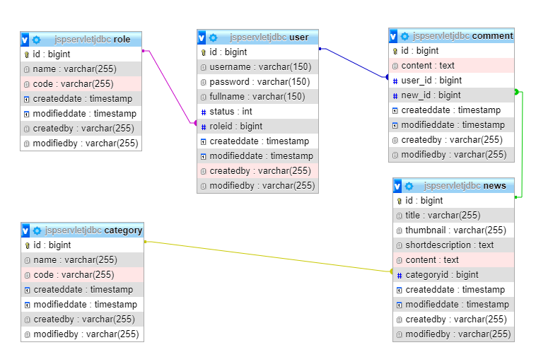

# 
RESTfull API WebService

# Giới thiệu
- Demo Restfull API Web Service cho ứng dụng Quản lý bài viết
- Kết nối, thao tác với CSDL MySQL bằng Spring Data JPA trong Spring boot

# Database
- Gồm các table: user, role, new, category, comment 
- Table "user" và "role" quan hệ nhiều-nhiều

# Sơ đồ quan hệ giữa các bảng trong MySQL

# Các chức năng
## 1. Chức năng thêm, sửa, xóa bằng Spring Data JPA trong Spring Boot
## 2. Chức năng hiển thị và phân trang bằng Spring Data JPA trong Spring Boot